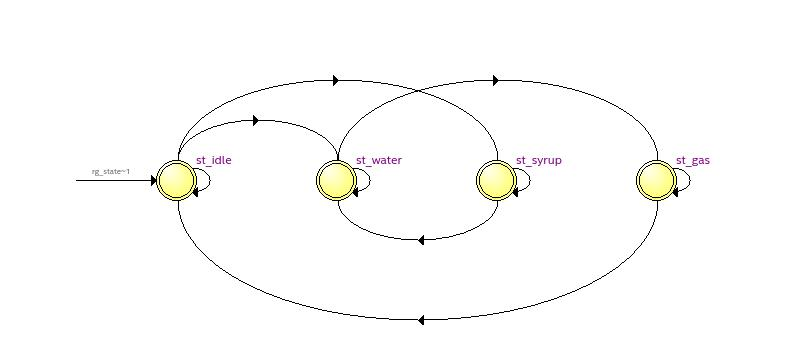
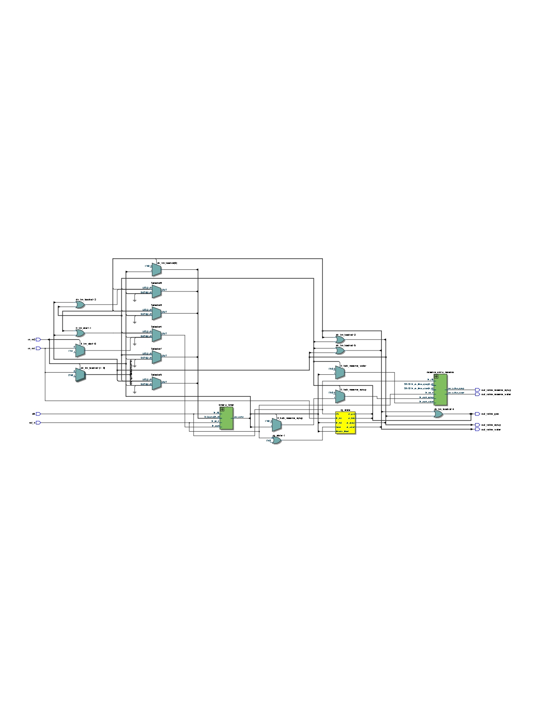

# Soda Machine (USSR)

## Соглашения по именованию сигналов

В проекте используется префиксная система по ГОСТ:

- `in_`  — входные сигналы модуля (например, `in_m1`, `in_clk`)
- `out_` — выходные сигналы модуля (например, `out_valve_water`)
- `rg_`  — регистры (хранящие состояние, например `rg_state`)
- `ns_`  — next state (следующее состояние)
- `fl_`  — флаговые сигналы (однобитные управляющие, например `fl_done`)
- `dv_`  — двоичные величины/длительности (`std_logic_vector`, например `dv_tm_loadval`)

Это позволяет сразу понимать роль сигнала.

---

## Описание модулей

### 1. `timer.vhd`
Базовый модуль счётчика с FSM:
- Принимает сигнал `in_start` и загружаемое значение `in_loadval`.
- Отсчитывает заданное число тактов (`cn_width` задаёт разрядность).
- По завершении формирует флаг `out_done = '1'`.

Используется всеми автоматами для реализации задержек.

---

### 2. `reserve_fsm.vhd`
Автомат резервной дозаправки **одного ресурса** (например, воды или сиропа).
- Запускается импульсом `in_kick`.
- Работает в двух состояниях: `st_idle` и `st_fill`.
- При переходе в `st_fill` включает клапан (`out_valve`) и запускает `timer`.
- После окончания времени дозаправки (`fl_t_done = '1'`) возвращается в `st_idle`.

---

### 3. `reserve_unit.vhd`
Структурный модуль, объединяющий **два автомата `reserve_fsm`**:
- Один управляет резервной водой.
- Второй управляет резервным сиропом.
- На вход подаются отдельные сигналы запуска (`in_start_water`, `in_start_syrup`) и длительности (`in_dv_time_water`, `in_dv_time_syrup`).
- На выходе формируются клапаны (`out_valve_water`, `out_valve_syrup`).

---

### 4. `soda_machine.vhd`
Главный автомат, описывающий работу советского автомата газированной воды:
- Состояния: `st_idle`, `st_syrup`, `st_water`, `st_gas`.
- Поведение:
  - Если вставлена монета 3 копейки → сначала сироп, потом вода, потом газ.
  - Если вставлена монета 1 копейка → сразу вода, потом газ.
- Управляет таймером (`timer.vhd`) для задания длительности каждого этапа.
- По окончании газирования запускает `reserve_unit`, который параллельно заливает резервные воду и сироп (если использовались).

---

## Диаграммы

**State diagram (главный автомат)**

**RTL (Quartus RTL Viewer)**

---

  

